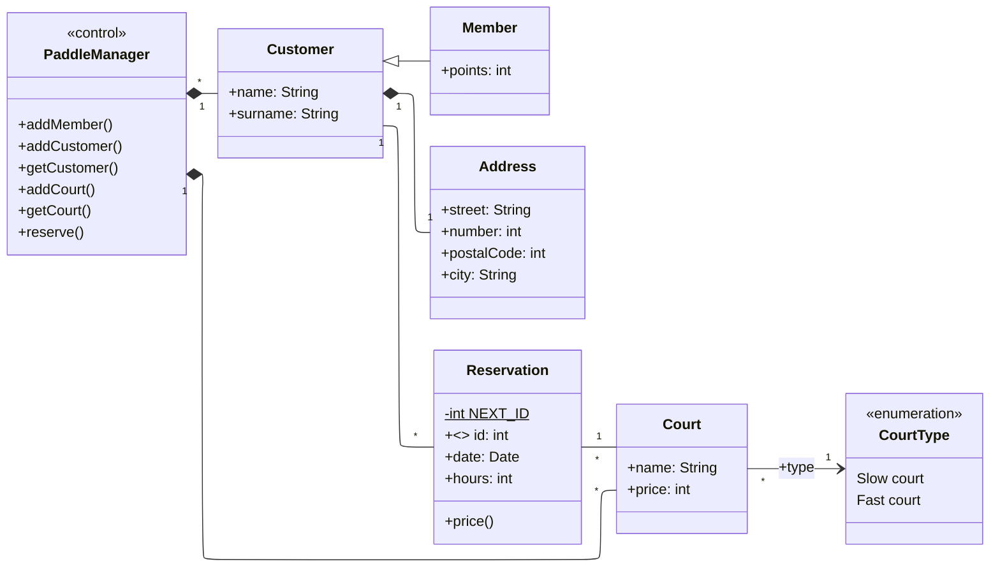

# Ejercicio 2

Implementar con IntelliJ un pequeño prototipo (en inglés) de una aplicación de gestión de reservas de canchas de pádel a partir del siguiente diagrama de clases.

### Diagrama de Clases

- **PaddleManager (Control):** Gestiona clientes y pistas.
- **Customer:** Representa a un cliente con nombre, apellido y dirección.
- **Member:** Un tipo de cliente que acumula puntos.
- **Address:** La dirección de un cliente.
- **Court:** Una pista de pádel con nombre, precio y tipo.
- **CourtType (Enum):** Tipos de pista (lenta o rápida).
- **Reservation:** Una reserva realizada por un cliente para una pista en una fecha y hora determinadas.

### Lógica de Prueba en Main

Para probar la aplicación, el método `main` debe:

1.  Crear una instancia de `PaddleManager`.
2.  Añadir un `Customer` y un `Member`.
3.  Añadir dos `Court` de diferente tipo.
4.  Obtener los clientes creados.
5.  Crear una reserva para cada cliente en una pista diferente.
6.  Obtener la primera reserva de cada cliente.
7.  Imprimir los detalles de cada reserva (usando `toString()`) y su precio calculado.
